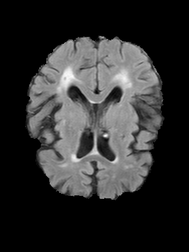
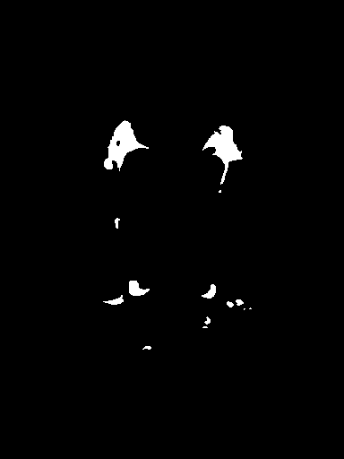

# CAD  
##### Computer Aided medical Diagnosis
---

### Assignment week 7, detection of white matter lesions

This assignment involves the detection of white matter lesions in the brain from MR images. Three different types of MR images are used as input (T1-weighted, T2-weighted and FLAIR-weighted). See image above for an example (FLAIR-weighted and annotated image, which is the ground truth).

50 2D slices of scans are available (200 images in total). Classifications are made on a pixel level with pixel based features, like the brightness value, the distance transform from the brain edge, a blobness measure and more.

A [dice similarity coefficient (DSC)](https://en.wikipedia.org/wiki/S%C3%B8rensen%E2%80%93Dice_coefficient) greater than 0.5 was achieved.

#### Dependencies
* **Python 2.7**
* **scikit-learn** ML stack (sklearn, numpy, scipy, matplotlib, skimage)
* **OpenCV2**
* **hickle** (pickle or cPickle can be used instead)
* **tqdm**

#### Contributors
* Robbert van der Gugten (@robbertvdg)
* Inez Wijnands (@Moorkopsoesje)
* Guido Zuidhof (@gzuidhof)
