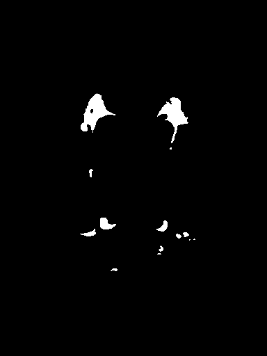

### Assignment week 7, detection of white matter lesions

Guido Zuidhof (s4160703), Robbert van der Gugten (s4137140) and Inez Wijnands (s4149696).  
23/3/2016

----
## Introduction

#### Goal
This assignment involves the detection of white matter lesions (WMLs) in the brain from MR images. Classifications are made on pixel level with pixel based features, like brightness value, distance transforms and a blobness measure. There are 50 samples of 2D slices of scans available, each containing three images as input (T1-weighted, T2-weighted and FLAIR-weighted) and fourth an annotated image where the actual WMLs are located, which is the ground truth, which makes 200 images in total. All images have the same size: 384 x 512 pixels.

The goal is to best classify where WMLs are located, and evaluate the predictions using the annotated images. Engineering informative features is an important part of this.

#### Implementation
We refer to our [Git repository](https://github.com/gzuidhof/cad) for our source code. We make use of the following dependencies:
* **Python 2.7**
* **scikit-learn** ML stack (sklearn, numpy, scipy, matplotlib, skimage): analysis and machine learning functions
* **OpenCV2**: morphological editing functions, used a lot in preprocessing
* **hickle** (pickle or cPickle can be used instead): read and write files
* **tqdm**: progress bars

## Method

#### Feature Engineering
We used a 15-dimensional feature set. We used pixel based features based on the characteristics of WMLs and the nature of the input images. WMLs typically have a high intensity, usually a blob-like structure and are located in the white matter, thus most likely some distance from the outer edge of the cortex. We use these characteristics in our feature engineering:

* **Intensity features**, the pixel values of the T1, T2 and FLAIR-weighted images (3x).
* **Distance transforms** to brain edge and folds/ventricles (2x).
  * Brain edge distance transform obtained by first thresholding the T1 weighted above 1 intensity, performing a closing morphology operation with a 3x3 kernel and finally computing the distance from every white pixel to a black pixel (see code snippet below).
  * The distance to ventricles or folds was obtained by the same process, but with a threshold of 100.

```python
  def dist_transform_feature(image, threshold):
      kernel = np.ones((3,3),np.uint8)

      #Create a binary threshold for the image
      mask = np.array(np.where(image >= threshold, 1,0), dtype=np.uint8)

      #Closing operation
      closing = cv2.morphologyEx(mask, cv2.MORPH_CLOSE, kernel)

      #Calculate distance transform
      distance_transform = cv2.distanceTransform(closing, cv2.cv.CV_DIST_L2,5)

      return distance_transform
```
* **Blobness measures**, both Laplacian of Gaussian (`skimage.feature.blob_log`) and Determinant of Hessian ( `skimage.feature.blob_doh`). For every pixel the value of this feature is set to the size of the blob the pixel is part of (6x).
* **Histogram equalized intensities**. This function is useful when the pixel values of an image are clustered in a specific range only. The function maps the intensity distributions to a wider and more uniform distribution, thus increasing the contrast of the image by profiting of the whole range of values. We used the intensity values of T1, T2 and FLAIR-weighted images after histogram equalization (3x) as features. We also applied contrast limited adaptive histogram equalization (CLAHE). Instead of normal histogram equalization which uses the global contrast of an image, CLAHE does this locally. However, this did not improve the classification result and was thus omitted.
* **Fraction of max feature**. We found that often the lesions were the brightest pixels in FLAIR-weighted images. This feature is a sort of inverse distance measure for every pixel to this intensity value, dramatized by performing some arbitrary high power, we used 4 (see code snippet below).  

```python
def fraction_of_max_feature(image):
    im_max = np.max(image)
    return (image/im_max)**4
```

#### Selection
We removed all points that had a completely empty feature vector (sum=0) from the train set, these are the dark points outside of the brain in the image. This removes around 4 million pixels out of 6.5 million. Furthermore, we remove negative cases to slightly rebalance the dataset. We experimented with different fractions of positive cases, and ended up with a 5% share of positive cases resulting in the best performance.

#### Normalization
We normalize all features so that they have zero mean and unit-variance. So for every feature dimension `x:= (x-mean(x))/std(x)`. Here, we are careful not to touch the completely black pixels in the test set.

#### Classification
We used 5 different classifiers:

* **Logistic Regression** - A generalized linear model which uses a logistic function to estimate probabilities for classification.
* **AdaBoost** - It first fits a classifier on the original dataset, followed by copies of that classifier but with adjusted weights of incorrectly classified instances, to focus on difficult cases.
* **Random Forest** - Fits multiple decision tree classifiers and uses averaging to improve the accuracy and control overfitting
* **Support Vector Machine Linear Kernel** - Finds the best fit in the training set using linear separators. New points are classified as the region they lie in, see figure for an example.
* **Support Vector Machine RBF Kernel** - Same as above, only the separators are non-linear. See figure for example.  <br><br>
   <br>  
  *Linear versus non-linear kernel SVM decision boundaries.*

We limited the SVM iterations to 100,000 due to time constraints (taking around 8 hours to train each with internal 5-fold cross validation to estimate probabilities). This caused the non-linear SVM to end prematurely before convergence.

#### Postprocessing (threshold optimization)
After predictions are made, we optimize the decision boundary. In other words, the probability threshold above which the point is classified as a white matter lesion. We use the `L-BFGS-B` algorithm found in `scipy.optimize` for this step, with the Dice similarity coefficient as the objective function.

#### Evaluation
The Dice similarity coefficient evaluates the similarity between the predicted image of the classifier with the annotated image. Since the images are mostly black, just comparing the images pixel-wise and calculating the accuracy is not very informative since an all-black image as prediction would still match a lot of the pixels in the annotated image. The Dice similarity coefficient is more balanced, in that it uses the amount of white pixels in the predicted image and the annotated image in its measure instead of also including all black pixels. For each image, the amount of white pixels of the annotated image times two, is divided by the sum of white pixels in both prediction image and annotated image (see code snippet below).
```python
def dice(prediction, y):
    dices = [dice_score_img(p,t) for p,t in zip(prediction,y)]
    mean = np.mean(dices)
    std = np.std(dices)

    return mean, std, dices

def dice_score_img(p, y):
    return np.sum(p[y == 1]) * 2.0 / (np.sum(p) + np.sum(y))
```

## Results

| Classifier                         | Mean Dice | Standard Deviation |
|------------------------------------|-----------|--------------------|
| **Logistic Regression**            | 0.36      | 0.23               |
| **Random Forest** (200 estimators) | **0.51**  | **0.18**           |
| **AdaBoost** (200 estimators)      | 0.48      | 0.20               |
| **SVM** (Linear kernel)            | 0.32      | 0.22               |
| **SVM** (RBF kernel)               | 0.47      | 0.20               |

  <br>
*On the Y axis is the Dice similarity coefficient score.*

#### Example classifications
On the left you can see the probabilities for either class as predicted by the model, on the right you can see the binary thresholded version of this. The first image is the ground truth.

<div id="wrapper" style="text-align: center">   
<div align="center" style="width:600px; display: inline-block; ">
<p align="center">

<br>
<b>Ground truth</b>

<br>   
<b>Logistic Regression</b>

<br>    
<b>Random forest</b>

<br>  
<b>AdaBoost</b>

<br>  
<b>Linear SVM</b>

<br>  
<b>RBF SVM</b>

</p>
</div>
</div>

The best performing model is the Random Forest classifier, noted must be that the number of estimates parameter of this method was set to a huge value (200, taking around 14GB of memory to compute). With a lower setting (10) it also achieved better performance than the Logistic Regression model.

## Future improvements

#### More data
The performance can probably be increased a lot if you have more samples. 50 samples is a quite small amount. You see a lot of prediction images containing part of the corpus callosum and other normal brain structures, which might be due to the large variance between brain structures, normal or healthy. Having more data might improve classifier performance by recognizing these structures as non-features.

#### Better features

Feature-wise we can make big gains. We might increase performance by adding features that use the neigborhood of pixels. Editing the existing we use a bit could help in more ways. We only use methods for blobness that draw the blobs circular on a feature map. Since this throws out some information, we could try a blobness measure that is not circular. Also, aside from only having the size of the blob as pixel feature, the distance to the center could also be informative.

We only used supervised feature extraction based on known characteristics of WMLs or what we could think of ourselves, but we might also want to look into unsupervised feature extraction, since such a method might find informative features we did not.

#### Parameter optimization
The (hyper)parameters of our method were hardly optimized, these could be optimized on a validation set.
