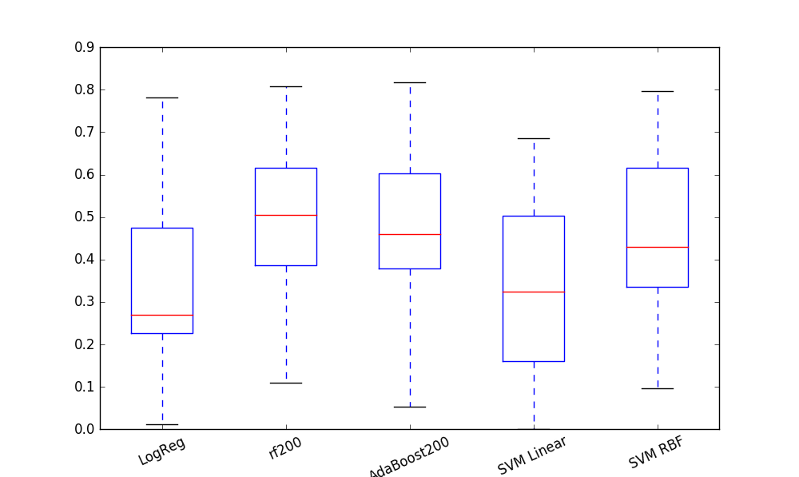
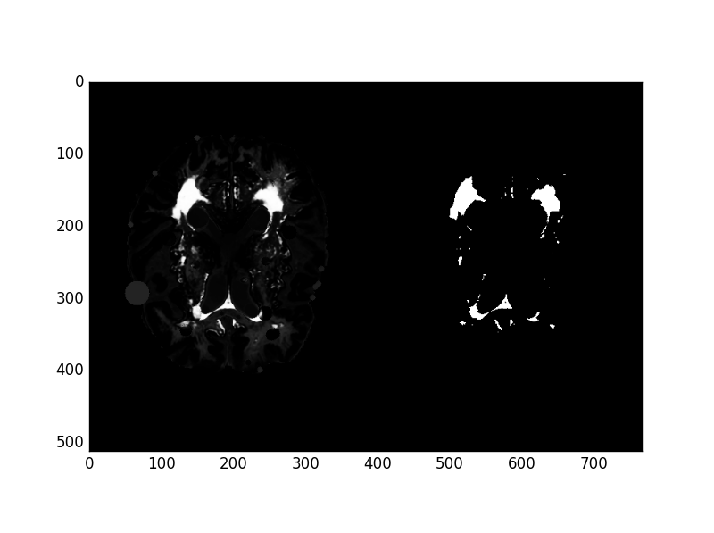

### Assignment week 7, detection of white matter lesions

Guido Zuidhof (s4160703), Robbert van der Gugten (s??) and Inez Wijnands.  
23/3/2016

----
## Introduction

### Goal

### Implementation
**LINK et al, zeggen welke libraries gebruikt zijn waarvoor**


## Method

### Feature Engineering
We used a 15-dimensional feature set. **verhaal dat we pixel based features gebruiken, zoals in readme op github**

* **Intensity features**, the pixel values of the T1, T2 and FLAIR-weighted images (3x).
* **Distance transforms** to brain edge and folds/ventricles (2x).
  * Brain edge distance transform obtained by first thresholding the T1 weighted above 1 intensity, performing a closing morphology operation with a 3x3 kernel and finally computing the distance from every white pixel to a black pixel (see code snippet below).
  * The distance to ventricles or folds was obtained by the same process, but with a threshold of 100.

```python
  def dist_transform_feature(image, threshold):
      kernel = np.ones((3,3),np.uint8)

      #Create a binary threshold for the image
      mask = np.array(np.where(image >= threshold, 1,0), dtype=np.uint8)

      #Closing operation
      closing = cv2.morphologyEx(mask, cv2.MORPH_CLOSE, kernel)

      #Calculate distance transform
      distance_transform = cv2.distanceTransform(closing, cv2.cv.CV_DIST_L2,5)

      return distance_transform

```
* **Blobness measures**, both Laplacian of Gaussian (`skimage.feature.blob_log`) and Determinant of Hessian ( `skimage.feature.blob_doh`). For every pixel the value of this feature is set to the size of the blob the pixel is part of (6x).
* **Histogram equalized intensities**. Intensity values of T1, T2 and FLAIR-weighted images after histogram equalization (3x). We also applied contrast limited adaptive histogram equalization (CLAHE), but this did not improve the classification result and was thus omitted.
* **Fraction of max feature**. We found that often the lesions were the brightest pixels in FLAIR-weighted images. This feature is a sort of inverse distance measure for every pixel to this intensity value, dramatized by performing some arbitrary high power, we used 4 (see code snippet below).  

```python
def fraction_of_max_feature(image):
    im_max = np.max(image)
    return (image/im_max)**4
```

### Selection
We removed all points that had a completely empty feature vector (sum=0) from the train set, these are the dark points outside of the brain in the image. This removes around 4 million pixels out of 6.5 million. Furthermore, we remove negative cases to slightly rebalance the dataset. We experimented with different fractions of positive cases, and ended up with a 5% share of positive cases resulting in the best performance.

### Normalization
We normalize all features so that they have zero mean and unit-variance. So for every feature dimension `x:= (x-mean(x))/std(x)`. Here, we are careful not to touch the completely black pixels in the test set.

### Classification
We used 5 different classifiers:

* **Logistic Regression** - A generalized linear model which uses a logistic function to estimate probabilities for classification.
* **AdaBoost** - It first fits a classifier on the original dataset, followed by copies of that classifier but with adjusted weights of incorrectly classified instances, to focus on difficult cases.
* **Random Forest** - Fits multiple decision tree classifiers and uses averaging to improve the accuracy and control overfitting
* **Support Vector Machine Linear Kernel** - Finds the best fit in the training set using linear separators. New points are classified as the region they lie in, see figure for an example.
* **Support Vector Machine RBF Kernel** - Same as above, only the separators are non-linear. See figure for example.  <br><br>
   <br>  
  *Linear versus non-linear kernel SVM decision boundaries.*

We limited the SVM iterations to 100,000.

### Postprocessing (threshold optimization)
After predictions are made, we optimize the decision boundary. In other words, the probability threshold above which the point is classified as a white matter lesion. We use the `L-BFGS-B` algorithm found in `scipy.optimize` for this step, with the Dice similarity coefficient as the objective function.

### Evaluation
**TODO EVALUATION UITLEG, geef formule dice similarity coefficient score zeker ook**


## Results

| Classifier                         | Mean Dice | Standard Deviation |
|------------------------------------|-----------|--------------------|
| **Logistic Regression**            | 0.36      | 0.23               |
| **Random Forest** (200 estimators) | **0.51**      | **0.18**               |
| **AdaBoost** (200 estimators)      | 0.48      | 0.20               |
| **SVM** (Linear kernel)            |           |                    |
| **SVM** (RBF kernel)               |           |                f   |

  <br>
*On the Y axis is the Dice similarity coefficient score.*

**TODO mooier opmaken**
**Links staat telkens de probabilities, rechts na binary classification, zoek ook de annotation er nog even bij en voeg die toe (kun je vast wel op het oog)**
## Example classifications

<div id="wrapper" style="text-align: center">   
<div align="center" style="width:600px; display: inline-block; ">
<p align="center">
<!-- <br>  *True annotation*<br>

 <br>  *Logistic Regression*<br>

 <br>  *Random forest*<br>

 <br> *AdaBoost*<br>

 <br> *Linear SVM* <br>

 <br> *RBF SVM* <br> -->

 
*Ground truth*<br>

   
*Logistic Regression*<br>

    
*Random forest*<br>

   
*AdaBoost*<br>

   
*Linear SVM* <br>

  
*RBF SVM* <br>

</p>
</div>
</div>


**TODO UITLEG, RF IS BESTE, miss kun je bedenken waarom?**

## Future improvements
Meer data
Meer neighborhood features_test
Betere blobness measures (niet ronde blobs)
Parameter optimization van classifiers (op validatieset, niet testset)
Unsupervised feature extraction (coates?)
Je kan er vast zelf ook nog wel wat bedenken
